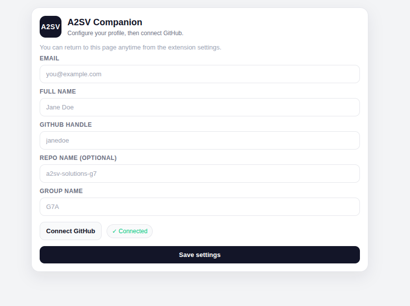
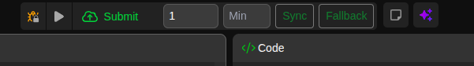
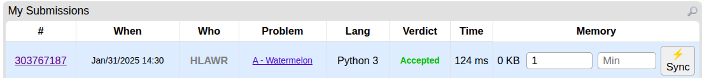
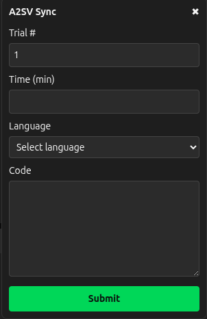

# A2SV Companion Extension

Sync LeetCode, Codeforces, and other supported platforms to GitHub and the A2SV tracking sheet.

## Quick Start (with screenshots)
Here is the quick start guide to get you up and running. (Note: For a detailed, picture-by-picture guide, check our GitHub repository linked at the bottom).

### Step 0: Prepare Your GitHub
Before installing, make sure you have a Public Repository created on your GitHub account (e.g., a2sv-solutions, my-solutions,....).
Note: If you don't have one, the extension will try to create it for you, but having one ready is safer!

### Step 1: Installation
1. Download the extension folder.
2. Open Chrome and navigate to chrome://extensions.
3. Toggle Developer mode (top right) to ON.
4. Click Load unpacked and select the dist folder from the extension files.
📌 Pro Tip: Pin the extension to your toolbar immediately!

### Firefox Installation (Temporary Add-on)
1. Build Firefox package:
   - `npm run package:firefox`
2. Open Firefox and go to `about:debugging#/runtime/this-firefox`.
3. Click **Load Temporary Add-on**.
4. Select `dist/manifest.json`.

Note: Temporary add-ons are removed when Firefox closes. Reload from `about:debugging` when needed.

### Step 2: Configuration (The Important Part)
1. Click the extension icon and open the Settings/Popup.
2. Enter your details exactly as they appear on the progress sheet:
   - Full Name (Case sensitive!)
   - GitHub Handle & Email
   - Repo Name & Group Name (e.g., G7A)
3. Click Connect GitHub, authorize the app, close the success tab, and hit SAVE.

**Popup login/config**

### Step 3: How to Submit
LeetCode: You’ll see a Sync button near the submit area. Enter your Trial/Time and click!

**LeetCode sync UI**

Codeforces: Go to your My Submissions page. Enter your Trial/Time. Click the ⚡️ Sync button on any "Accepted" row.

**Codeforces sync UI**

Other Platforms: Use the draggable A2SV popup to fill in your info and submit.
Fallback: If "Sync" ever fails, click the Fallback button to manually paste your code and submit.

**Fallback panel**

### Step 4: What Happens Next?
Sit back. The extension automatically pushes your code directly to your GitHub repo AND logs your submission link and time into the Google Sheet!

### Crucial Reminders & Troubleshooting
- Exact match required: Your name must match the Google Sheet exactly, otherwise you will get a "Student not found" error.
- "Question not found" error: Make sure the problem is actually on the sheet. If it is, wait a moment and retry.
- "Unauthorized / GitHub token missing": Go to settings and reconnect your GitHub.
- If the Submit button isn’t appearing, refresh the problem page.

## Features
- One‑click sync to GitHub and Google Sheets
- Trial/time tracking per submission
- LeetCode and Codeforces enhanced UI
- Fallback panel for other platforms

## Install (Developer Mode)
1. Install dependencies: `npm install`
2. Build the extension:
   - Chrome/Chromium: `npm run package`
   - Firefox: `npm run package:firefox`
3. Open Chrome → Extensions → Enable Developer Mode.
4. Load Unpacked → select the `dist` folder (Chrome MV3 build).

### Firefox (Developer Mode)
1. Run `npm run package:firefox`.
2. Open `about:debugging#/runtime/this-firefox`.
3. Click **Load Temporary Add-on** and choose `dist-firefox/manifest.json`.

## Setup
1. Open the extension popup.
2. Enter email, name, GitHub handle, group name, and optional repo name.
3. Click Connect GitHub.
4. Click Save settings.

## Usage
- LeetCode: open a problem, set Trial/Time, click Sync.
- Codeforces: open “My Submissions”, click Sync on accepted rows.
- Other platforms: use the fallback button.

## Packaging for Distribution
- Build only: `npm run package`
- Build + obfuscate: `npm run package -- --obfuscate` (or `npm run package:obfuscate`)
- Output: `dist.zip` in the repo root

### Legacy Chromium Packaging (MV2)
- Build legacy package: `npm run package:legacy`
- Build legacy package + obfuscate: `npm run package:legacy:obfuscate`
- Output: `dist-legacy.zip` in the repo root

For unpacked install on old Chromium builds, load from `dist-legacy`.

Use this only for older Chromium-based browsers that fail with "unsupported manifest version".
Your main package remains MV3 and is unchanged.

### Firefox Packaging
- Build Firefox package: `npm run package:firefox`
- Build Firefox package + obfuscate: `npm run package:firefox:obfuscate`
- Output: `dist-firefox.zip` in the repo root

## Notes
- Ensure the backend is running and you’ve connected GitHub successfully.
- If you update the extension, reload the unpacked extension and refresh the tab.
- Firefox note: some Firefox channels disable MV3 `background.service_worker`; use `npm run package:firefox` for compatibility.

## Repository
 - Repo: https://github.com/apeiron888/a2sv_extension